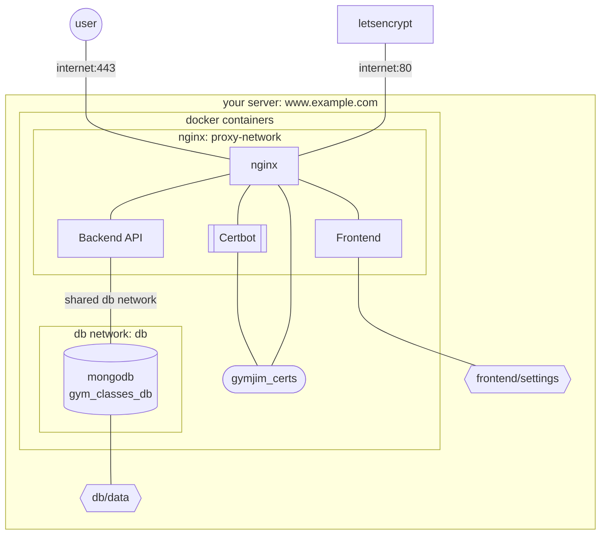

* user sign up and be able to see upcoming classes
* plus an admin panel:
input new classes with a picture + description, maximum signups, date for signups, etc.

## Prereqs

1. **Setup a domain for your server**
     * Purchase a domain.
     * Ensure your server has a static IP
     * Create an A record mapping the ip to the domain
2. **Setup network and server**
     * Ensure ports 80 and 443 are open to the internet
3. Install prereqs
     * [Docker](https://www.docker.com/get-started/)  
     * [Git](https://www.git-scm.com/)
4. **Setup repository**
     * Clone this repo 
       * navigate to the desired project location in your server via your terminal
       * run `git clone https://github.com/Tropicode-Guam/gymjim`
     * Create settings files
       * Create a `.env` file
         * copy [.env.sample](.env.sample) and name it `.env`
         * fill in all the environment variables
       * in the `frontend/settings` folder, create `general.json` and `insurances.json` files matching their example formats: `general.sample.json` and `insurances.sample.json` (read more about settings [below](#settings--configs))

## Deployment

`docker compose up -d --build`

\* note: this docker-compose.yml was made with docker [rootless mode](https://docs.docker.com/engine/security/rootless/) in mind. If you are running this in root mode (the default), you might need to start it by first unsetting the `XDG_RUNTIME_DIR` environment variable like so: `unset XDG_RUNTIME_DIR && docker-compose up -d --build`

## Development

`docker compose -f docker-compose.dev.yml up --build`

## Architecture



## Settings & Configs

* ⚠️ Be careful with spacing in the `.env` file and be careful with commas and double quotes in the `general.json` and `insurances.json` files. Incorrect format may prevent them from being loaded.
* ⚠️ You should setup the `.env` file before running this in production (deployment). Once you run it for the first time, it will setup the database according to those settings. changing settings in the `.env` file afterwards may require alterations to the database to get it working again.
* ℹ Note in production (deployment) mode, you will need to rerun the startup command to see the effects of changes to `frontend/settings` files.

### `.env` file

* The `DB_ROOT_USERNAME` and `DB_USER` should not be the same and their passwords should be secure pass phrases and also not the same.
* The `ADMIN_USER` and password will be the only credentials used by users when accessing your.domain.com/classes/admin.
* `HOST` should be your domain excluding the https:// part. For example: your.domain.com

### `general.json` file

The `Fee Message` setting replaces all occurances of `{FEE}` with the fee for that particular class. For example if the setting was `Pay {FEE} dollars at the gate.`, then the message would be *Pay 5.00 dollars at the gate.* assuming the class has a fee of 5.00.

### `insurances.json` file

This file is broken into 2 sections, the `Insurances` section and the `Sponsors` section.

#### `Insurances` section

The options listed here will show up on the signup form in the insurance dropdown list. Selecting an insurance other than Other/None will cause a new field to appear. This field will by default say `Insurance Member ID`. If you would like to change what that field says for a particular insurance option, change the option to this format:

```json
{
  "name": "Insurance Name",
  "id_name": "Appeared Field Name"
}
```

`name` should be the insurance name and `id_name` should be the text you want to replace `Insurance Member ID` with.

#### `Sponsors` section

The options listed here will show up on the Sponsors dropdown in the admin menu when creating a new class. If a class is sponsored by the same insurance that the user signing up chooses as their insurance, they can take the class for free. Note that the insurance names in the `Insurances` list and the `Sponsors` list need to be exactly the same for this to be the case.

If you want a particular sponsor to make multiple insurances choices free for the user, use the following format:

```json
{
  "name": "Insurance Name",
  "also_free_for": "Other Insurance Name"
},
```

`name` should be the sponsor name and `also_free_for` should be the name of the other insurance that will be free if chosen by the user. Note that this allows you to have more control in what shows up as the sponsor, for example you could make the `name` be `TakeCare and Triple J` and make `also_free_for` be `TakeCare`, allowing users of TakeCare to sign up for free.

`also_free_for` can also be a list of other insurance names like so:

```json
{
  "name": "Paradise Fitness",
  "also_free_for": [
    "TakeCare", 
    "Calvo's SelectCare"
  ]
}
```
If a class is sponsored by this sponsor, users of any of these insurances get in free.

Finally, `also_free_for` can also be the special value `all`. A class doesn't need to be sponsored by this insurance for users to get into any class by choosing this insurance. This can be used in conjunction with the `Insurances` list to for example make all `Hotel Guest` *"insurances"* free. Here is an example configuration showing how to do so:

```json
{
    "Insurances": [
        ...
        {
            "name": "Hotel Guest",
            "id_name": "Room Number"
        }
    ],
    "Sponsors": [
        ...
        {
            "name": "Hotel Guest",
            "also_free_for": "all"
        }
    ]
}
```

### Logs & Troubleshooting

#### Logs

You can access the logs by using the command `docker compose logs` (check out the [docs](https://docs.docker.com/reference/cli/docker/compose/logs/) for more detailed options)

If you suspect a problem with a certain portion of the app, you can use `docker compose logs` followed by one of the short service names below:

```
frontend
backend
db
nginx
certbot
```

#### Database

The Database is stored in the `db/data` folder, so if you'd like to make backups, do so by copying that directory.

If you'd like to execute queries on the database, you can open a shell to it using the following command for production (deployment):

`source .env && docker exec -it gym_classes_db mongosh -u $DB_USER -p $DB_PASSWORD production`

or this command for development:

`source .env && docker exec -it gym_classes_db mongosh -u $DB_USER -p $DB_PASSWORD development`

The database used is [MongoDB](https://www.mongodb.com/) version 7.0.3. You can find docs for the `mongosh` shell [here](https://www.mongodb.com/docs/mongodb-shell/crud/).

